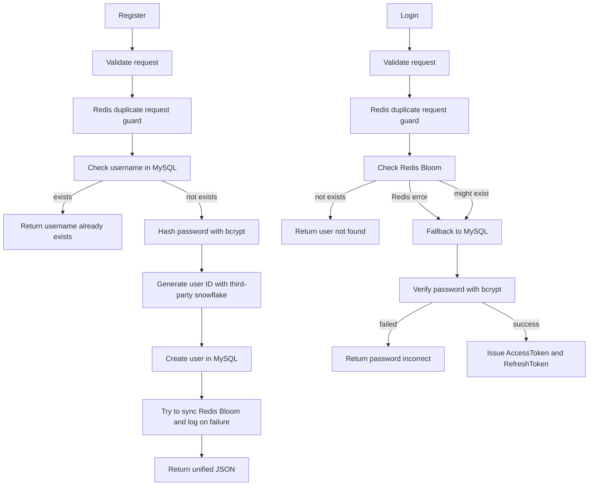

# User Module

## Flow



## APIs

- `POST /api/v1/auth/register`
- `POST /api/v1/auth/login`
- `POST /api/v1/auth/refresh`

## Redis Duplicate Request Guard

The duplicate request guard uses Redis `SETNX + TTL`.

- Register key: `register:{username}`
- Login key: `login:{username}`
- Current window: 2 seconds

## RedisBloom

- Bloom key: `bloom:users`
- The implementation uses RedisBloom module commands: `BF.RESERVE`, `BF.ADD`, and `BF.EXISTS`.
- Startup reserves the Bloom filter and loads existing users from MySQL.
- Register creates the MySQL user first, then tries to sync RedisBloom.
- If Bloom sync fails after user creation, the service logs the error and still returns success.
- Login falls back to MySQL when RedisBloom query fails.

## YAML Configuration

Copy the example config before local development:

```bash
cp configs/config.example.yaml configs/config.local.yaml
```

Generate JWT secrets:

```bash
openssl rand -base64 32
openssl rand -base64 32
```

For local JWT secrets, copy the example config to `configs/dev_local.yaml` and put real secrets there:

```bash
cp configs/config.example.yaml configs/dev_local.yaml
```

Only put real secrets in `configs/dev_local.yaml`, `configs/config.local.yaml`, or environment variables. Do not commit local config files or `.env`.

Configuration priority:

1. Environment variables
2. `configs/dev_local.yaml`
3. `configs/config.local.yaml`
4. `configs/config.example.yaml`
5. Built-in development defaults

## Unified Response

```json
{
  "code": 0,
  "message": "ok",
  "data": {}
}
```
