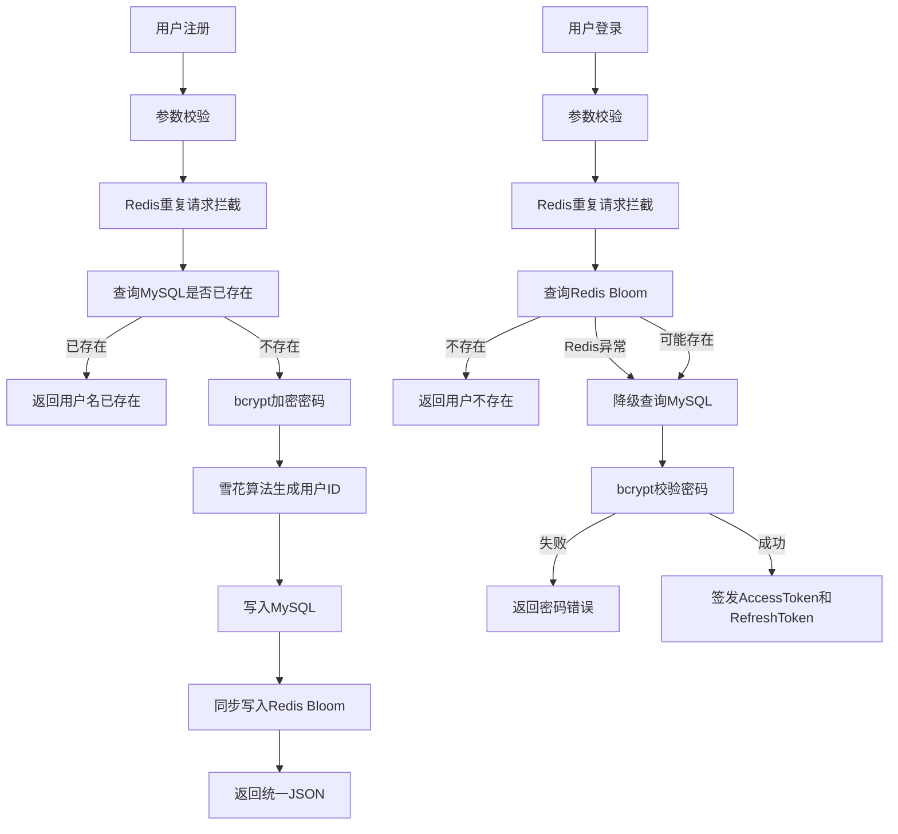

# 用户模块说明

## 流程逻辑图



## 接口

- `POST /api/v1/auth/register`
- `POST /api/v1/auth/login`
- `POST /api/v1/auth/refresh`

## Redis重复请求拦截

重复请求拦截使用 Redis `SETNX + TTL`。

- 注册 key：`register:{username}`
- 登录 key：`login:{username}`
- 当前窗口：2 秒

同一个 key 在窗口期内重复提交，会返回 `too many repeated requests`。

## 双Token刷新逻辑

1. 登录成功后返回 `AccessToken + RefreshToken`。
2. `AccessToken` 短期有效，用于业务接口鉴权。
3. `RefreshToken` 长期有效，用于无感刷新。
4. 前端调用 `/api/v1/auth/refresh` 并传入 `refresh_token`。
5. 服务端校验 `RefreshToken`，通过后重新签发一对 Token。

## Redis Bloom初始化逻辑

1. 服务启动时连接 MySQL 和 Redis。
2. 查询 MySQL 中所有 `users.username`。
3. 将 `login:{username}` 写入 Redis Bloom 位图。
4. 注册成功后，同步将新用户 `login:{username}` 写入 Redis Bloom。
5. 登录时先查 Redis Bloom，命中再查 MySQL。
6. Redis Bloom 查询异常时，不误判为用户不存在，而是降级查 MySQL。

Redis Bloom key：

```text
bloom:users
```

## 雪花算法工具类

- 文件位置：`internal/utils/snowflake/snowflake.go`
- 作用：生成全局唯一 `UserID`
- 组成：时间戳 + 数据中心 ID + 机器 ID + 序列号

## 安装依赖

```bash
go mod tidy
```

核心依赖：

- `github.com/gin-gonic/gin`
- `github.com/redis/go-redis/v9`
- `golang.org/x/crypto/bcrypt`
- `gorm.io/gorm`
- `gorm.io/driver/mysql`

## 配置

```bash
APP_ADDR=:8080
MYSQL_DSN=root:root@tcp(127.0.0.1:3306)/feed_system?charset=utf8mb4&parseTime=True&loc=Local
REDIS_ADDR=127.0.0.1:6379
REDIS_PASSWORD=
REDIS_DB=0
JWT_ACCESS_SECRET=MngocHL52zG8fSF4AJ32morOAdbWd32AMnLu6aLqIOs=
JWT_REFRESH_SECRET=01lCeVmb2BlDnEgzQ81TWL5T3PZww8ArrvFw26tkXEE
JWT_ACCESS_TTL_SECONDS=900
JWT_REFRESH_TTL_SECONDS=604800
JWT_ISSUER=feed_system
BLOOM_BITS=1000000
BLOOM_HASHES=7
SNOWFLAKE_WORKER_ID=1
SNOWFLAKE_DATACENTER_ID=1
```

## 统一返回结构

```json
{
  "code": 0,
  "message": "ok",
  "data": {}
}
```
