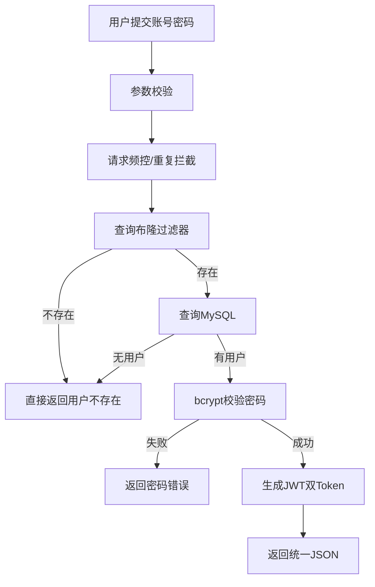

# 用户登录模块说明

## 流程逻辑图



## 双Token刷新逻辑

1. 登录成功后返回 `AccessToken + RefreshToken`。
2. `AccessToken` 短期有效，用于业务请求鉴权。
3. `RefreshToken` 长期有效，用于无感刷新。
4. `RefreshToken` 失效前，前端调用 `/api/v1/auth/refresh`。
5. 服务端校验 `RefreshToken`，通过后重新签发一对新 Token。

## 布隆过滤器初始化逻辑

1. 服务启动时连接 MySQL。
2. 自动迁移 `users` 表结构。
3. 查询所有用户的 `username`。
4. 将 `login:{username}` 写入布隆过滤器。
5. 登录时先查布隆，命中再查数据库。

## 雪花算法工具类

- 文件位置：`internal/utils/snowflake/snowflake.go`
- 作用：生成全局唯一 `UserID`
- 组成：时间戳 + 数据中心 ID + 机器 ID + 序列号
- 特点：单机高并发下可持续递增，适合 MVP 用户主键生成

## 安装依赖

```bash
go mod tidy
```

如本地拉包受限，可先确保以下依赖存在：

- `github.com/gin-gonic/gin`
- `github.com/golang-jwt/jwt/v5`
- `golang.org/x/crypto/bcrypt`
- `gorm.io/gorm`
- `gorm.io/driver/mysql`

## 配置文件

可通过环境变量配置：

```bash
APP_ADDR=:8080
MYSQL_DSN=root:root@tcp(127.0.0.1:3306)/feed_system?charset=utf8mb4&parseTime=True&loc=Local
JWT_ACCESS_SECRET=change-me-access-secret
JWT_REFRESH_SECRET=change-me-refresh-secret
JWT_ACCESS_TTL_SECONDS=900
JWT_REFRESH_TTL_SECONDS=604800
JWT_ISSUER=feed_system
BLOOM_BITS=1000000
BLOOM_HASHES=7
SNOWFLAKE_WORKER_ID=1
SNOWFLAKE_DATACENTER_ID=1
```

## 接口

- `POST /api/v1/auth/login`
- `POST /api/v1/auth/refresh`

## 统一返回结构

```json
{
  "code": 0,
  "message": "ok",
  "data": {}
}
```
